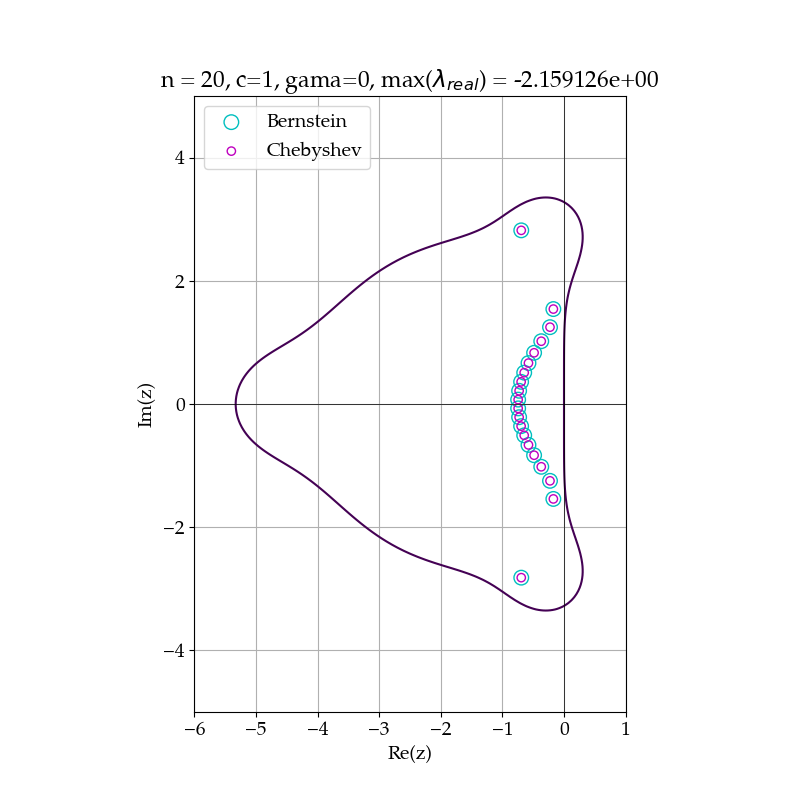

# bernstein-poly
Implementation of a Bernstein polynomial collocation method in Python

The code presented here is used in the paper: 
Symmetries of Bernstein Polynomial Differentiation Matrices and Applications to Initial Value Problems, Symmetry 2025, 17(1), 47; [https://doi.org/10.3390/sym17010047](https://doi.org/10.3390/sym17010047) 

In this implementation we test the use of symmetries in differentiation matrices for the solution of various initial value problems for PDEs. We further compare the method to the Chebyshev spectral method.

Additional feature is the use od Chebyshev-Gauss-Lobatto (CGL) collocation nodes for Bernstein polynomials, which showed drastically improved behavior of the method. This was already observed in our previous work (Mirkov, N.; Rašuo, B. Bernstein Polynomial Collocation Method for Elliptic Boundary Value Problems. PAMM Proc. Appl. Math. Mech. 2013, 13, 421–422. [https://doi.org/10.1002/pamm.201310206](https://doi.org/10.1002/pamm.201310206)

Libraries used are: numpy, scipy and matplotlib.

For any questions contact me (email is given in the paper or at the github home page).

Example: The rk_stability.py plots scaled eigenvalues of the advection operator inside the stability region of RKSSP(5,4) method demonstrating striking feature of the present method, that the eigenvalues match those of Chebyshev spectral method.
The code enables changing the transport coefficients so one can test this for vaious convection-diffusion operators not ony pure advection.

